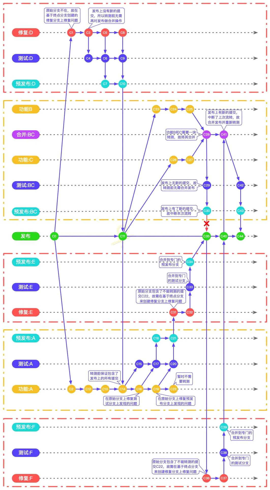

# Git-Work-Flow-Guide
Git learn、Git concept、Git work flow guide

## Git 协同工作流

## 项目简介/初衷
最近接到一个需求，梳理一个团队协作的规范。抱着一次收集整理，以后可以一直复用的想法。认真做一个收集与梳理。顺便发出来可以与大家一个交流学习。

## 工作流的目标/能解决的问题
* 看完之后从概念上理解Git的各项操作
* 多人协同开发之间的协调梳理
* 每个修改能最终溯源到对应开发者
* 生产环境隔离，确保任何收生产环境上的代码都是稳定版本

## 目录

## Git的基础介绍
**Git是什么？**  
Git是目前世界上使用最广泛的分布式版本控制系统（没有之一）。  
**那什么是版本管理？为什么我们需要版本管理**  
    简单举个例子：  
    假设我们要创作一篇文章。这篇文章是随着时间线的推进而进行内容的添加，修改，删除。  
    如何保存我们的成果呢？
    最基础的操作就是我们每写一段时间进行一次保存。这样就不怕各种特殊情况（包括但不限于软件闪退、电脑死机、大厦停电、世界末日等）对我们辛苦工作的成果造成破坏。  
    但是时间长了就会出现这样的问题：  
    1. 如果只在同一文件里面进行保存，我们永远只有一个版本（也就是最新版）的文件。假如我们希望找回3天之前觉得不好的段落，重新进行调整，~~几乎不可能实现~~只能靠大脑去记，什么？你说3天记住不是问题？那3周呢，3个月呢。  
    2. 如果隔一段时间保存在一个新的文件里面，一段时间下来。你就会被一堆文件给堆的眼花缭乱。如果让你去找3个月前的文章与现在的文章改过哪些地方。一个个去找大概会让你抓狂。  
    3. 更要命的事情来了，假如这个文章不是你一个人独立创作的。在你写的过程中，别人从你这要过去一个版本，帮你进行补充。你则继续写下去。等半个月过后别人将文件发会给你的时候。望着两个截然不同的文件。你要整理找到两个文件里面的差异，进行一个合并。如果文章已经写的很长的话，这将又会浪费你大量的时间。  
    就这样，人们发现，在一个项目的推进过程中，版本管理的重要性尤为突出，有了它，能更好地解决修改记录，多人协作等提高效率的能力。所以Git就在这个背景下出现了！  
**除了Git，还有什么这类型的软件吗？**  
目前除了Git，比较出名的的还有CVS、SVN等都是为了版本管理而生的软件，不过他们都是集中式管理的，不但速度慢，而且还必须联网才能用。而Git的设计里面就是分布式管理，加上他底层是由C语言实现的。种种优势使得他成为目前最主流的版本管理软件。   

## 几个概念
### Repository/版本库/仓库
Git的仓库你可以简单理解为一个文件夹，放在仓库里面的文件都可以被Git所管理。每个仓库都是可以独立、脱机地进行工作的。  
通过仓库所在位置，我们也可以简单区分为：本地仓库（在本机的仓库）、远程仓库（除了本地的仓库都是远程仓库）。  
虽在Git是分布式管理的理念，但是为了更好的去理解与管理。实际项目中，我们通常会人为地约定一个远程仓库作为“主仓库”，大家都通过这个“主仓库”来作为纽带同步各自的本地仓库。  

### 工作区
创建非裸仓库之后，在这个目录中文件就是存放在工作区中。所有的文件更改都是在工作区进行的。

### Index/索引/暂存区
文件更改后，如果想要提交到仓库，需要先通过add命令，将改动添加进Git的索引里面。然后通过commit将改动添加进仓库。

### Branch分支  
我们可以把仓库中的改动记录想象成有一条时间线关联。仓库里面所有的改动都是推着时间的推移在添加的。  
而分支，给我们创建了一个平行世界。让我们可以在两个平行世界，同时进行不同的修改。  
  
当两个平行世界的工作都完成之后，一合并，我们的项目就相当于完成了两个工作！  
  
**在这里约定一个观念：我们认为Git仓库中始终有且仅有一条主线（master）。所有的分支最终都是会合并进主线然后删除的。*  

### stash/储藏区
当你正完成手上的工作时。突然接到一个紧急任务去处理。但是目前手上的工作也还没完成到可以提交的时候。就需要用到储藏区。可以把当前工作区的改动全部储藏起来。回到当前分支没有任何改动的时候。这时候去处理紧急任务。搞定提交之后再把储藏区的记录复原出来。继续工作！

### 以上几个区域的关系划分
|储藏区|stash(push/pop)|工作区|(add/reset)|索引区|(commit/recet)|本地仓库|(push/pull)|远程仓库|  
|------|-----|------|----|------|-----|--------|---|--------|  

### 日常Git工作流程

## 一些基础操作
### Repository/版本库/仓库
#### 创建一个库（初始化）
终端进入一个目录，使用命令：
> <code>$ git init</code>  

这样，这个目录就成为一个可以被Git管理的仓库啦。  
**git init的一些常用可选参数**  
> -q --quiet    : 安静！只有错误信息会提示，其他信息统统屏蔽。  
> --bare    ：裸仓库。通常远程的主仓库会使用这个参数。使用过后，这个目录里面将只有版本管理。没有工作区。  
 > -b <分支名称>    ：为仓库中初始化的分支命名。
#### 从一个远程仓库克隆
> <code>$ git clone <远程仓库地址></code>  

**git clone的一些常用可选参数**  
> --bare    ：裸仓库。通常远程的主仓库会使用这个参数。使用过后，这个目录里面将只有版本管理。没有工作区。  
> -o --origin <分支名称> :克隆仓库的时候选择克隆分支（默认源仓库的master分支）
> -b --branch <分支名称> :克隆仓库的时候选择本地分支（默认本地仓库的master分支）

### Index/索引/暂存区
#### add——将文件改动添加进index
> <code>$ git add <文件路径></code>  
**git add的一些常用可选参数**  
> 通常文件路径可以用 "."来表示当前文件夹所有改动 ->  
> <code>$ git add .</code>  包括修改（modified）与新文件（new）,不包括被删除的文件。  
> -u    :仅监控已被add的文件。即不会提交新文件。  
> -A    :上面两个功能的集合。

#### index中的改动添加进仓库（当前分支）  
> <code>$ git commit </code>  

**git commit的一些常用可选参数**  
> -m \<msg\>    :对此次提交的变更进行文字备注  
> --amend   :追加更改。将目前index区的改动追加到上一次commit的内容中。

#### reset——从仓库中撤销改动 git reset  [--soft | --mixed | --hard] [HEAD] <file>  
>  --mixed  :默认值，撤销add的改动  
>  --soft   :撤销commit的改动，但是保留改动在工作区  
>  --hard   :撤销commit的改动，并且删除改动  

> 撤销add的改动  
> <code>$ git reset --mixed HEAD -- <文件路径></code>  

> 撤销commit的改动  
> <code>$ git reset --soft HEAD~ </code>  

> **[HEAD]说明**    
> HEAD 表示当前版本  
> HEAD^ HEAD~ HEAD\~1 上一个版本  
> HEAD^^ HEAD\~2 上上一个版本  
> HEAD^^^ HEAD\~3 上上上一个版本  
> 以此类推...  

#### pull 从远程仓库中拉去更新

#### push 推送本地仓库中的更新到远程仓库
**强烈建议每次执行push操作之前，先执行一次pull操作！*

#### branch 查看管理分支
><code>$ git branch</code>  
默认返回当前库存在的所有分支以及当前所处的分支  
-a    :返回包括远程仓库的所有分支列表  
-d    :删除某个分支  

#### checkout 切换分支
><code>$ git checkout \<branch name></code>  
-b    :创建新分支  
**注意切换分支的时候，工作区以及索引区Index的改动都会被一起带过去新分支。（只要没有commit的部分都会被带过去）*

#### stash 储藏
如果不想将当前工作区的改动带到新分支怎么办？就用stash！  
><code>$ git stash \<branch name></code>  
默认储藏已经被记录的文件改动（不包括新增文件），并以当前最新一次commit的信息作为此次储藏信息。  
list    :列出当前全部储藏  
push    :默认储藏已经被记录的文件改动（不包括新增文件），并以当前最新一次commit的信息作为此次储藏信息。  
pop     :默认弹出最近的一次储藏。
**git stash的一些常用可选参数**  
> -m \<msg\>    :对此次储藏的变更进行文字备注  
> **如果希望将新增文件也储藏起来，需要在储藏前先将新增的文件通过add添加索引*

#### merge 分支合并
><code>$ git merge \<branch name></code>  
将目标分支合并进当前分支。（发生变化的是当前分支，目标分支不会有任何变化）
**git merge的一些常用可选参数**  
> --no-ff    :目标分支的多个commit将不会被合并，原封不动地将每个commit标记在时间线上。方便追溯到每个代码的变化。

### 工作流
虽然说有了Git这样强大、高效又方便的工具。但是再好的工具如果我们不加以规范使用，也会把我们的工作室搞得一团糟不是吗？  
为此，我们还是认为地约定好一些规范流程。这样在大家协同工作的时候可以更加有条理，更加清晰。而不是乱成一团糟。  
#### 大概思路
下图描述的是这个规范的一些大概的思路，至于详细操作的细节，由后面另外的图来进行补充。

可以看到有这么几个核心思想：  
1. 默认项目始终有且仅有一条主线。（上图中为master）  
2. 任意时候访问master线上都应该是经过测试的稳定发布版本。  
3. 至少有一条与主线平行的分支，用于代码开发进程。（上图中为develop）  
4. （可选）至少有一条与主线平行的分支，用于代码测试进程。（上图中为release）
5. 每个修复Bug，或者新功能添加均创建临时分支进行开发。在开发完成后合并进dev分支进行统一管理。
6. dev分支应该有管理员进行维护。管理合并请求，安排测试环境与生产环境的同步计划。
7. **（个人建议）如果团队人数不多，可以将新功能分支看作个人开发分支来使用。适当提高效率，减少分支复杂度**  

#### 进一步细化说明
**下图为更加详细的步骤说明图：**  

可以看到多出这么几个思想：  
1. 每次要提交到主分支之前，必须确保本地主分支与远程主分支的同步状态是最新的。
2. （可选）可单独为功能开出专门的测试分支。

## 如果有任何的意见与建议，欢迎随时交流

## 引用参考
[Git 官方文档](https://git-scm.com/docs)  
[A successful Git branching model](https://nvie.com/posts/a-successful-git-branching-model/)  
[Git分支规范(新)：Git并行工作流程规范](https://www.jianshu.com/p/d7a3a4935440)  
[菜鸟教程-Git教程](https://www.runoob.com/git/git-workflow.html)  
[廖雪峰的官方网站-Git教程](https://www.liaoxuefeng.com/wiki/896043488029600)  
